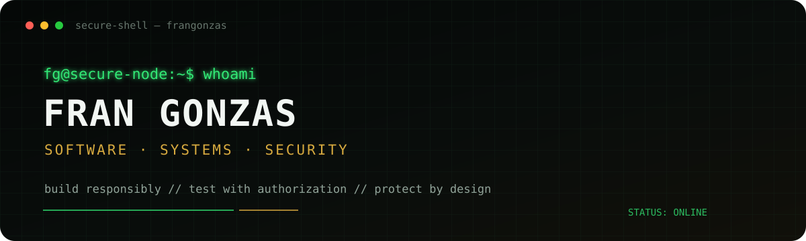

<p align="center">
  
</p>

<p align="center">
  <code>BUILD</code>&nbsp;&nbsp;·&nbsp;&nbsp;
  <code>ANALYZE</code>&nbsp;&nbsp;·&nbsp;&nbsp;
  <code>SECURE</code>&nbsp;&nbsp;·&nbsp;&nbsp;
  <code>ITERATE</code>
</p>

---

## `> whoami`

```text
Name       Fran Gonzas
Role       Software developer · Security-oriented engineering
Focus      Apple platforms · Secure communications · P2P · Applied cryptography
Mode       Continuous learning / building / testing
Policy     Authorized environments only
```

I build software with a strong interest in **security, privacy, distributed systems and resilient communication**.

My work combines product engineering with hands-on experimentation across Apple platforms, peer-to-peer networking, secure identity, encrypted data flows and Linux-based infrastructure.

> **Security is not decoration. It is architecture, verification and disciplined trust.**

---

## `> current_focus`

```text
[+] Swift / SwiftUI
[+] iOS and Apple ecosystem
[+] Secure communications
[+] Peer-to-peer architectures
[+] Applied cryptography
[+] Privacy-first design
[+] Network experimentation
[+] Linux infrastructure
[+] CloudKit and distributed synchronization
[+] Security-oriented UX
```

---

## `> selected_projects`

### `ONYXKODE`
**Secure communications research project**

Private messaging, cryptographic identity, P2P communication, QR-based encrypted exchange, emergency communication concepts and secure synchronization.

`Swift` `SwiftUI` `CryptoKit` `P2P` `CloudKit`

### `KOLECHAT`
**Decentralized community communications**

A community-oriented communications concept built around local discovery, shared events, alerts and privacy-conscious connectivity.

`Swift` `SwiftUI` `MultipeerConnectivity` `CloudKit`

### `MONTHIO`
**Market analysis and investment research interface**

Financial visualization, opportunity scanning, portfolio analysis and risk-oriented dashboards.

`Swift` `SwiftUI` `Charts` `Data Analysis`

### `SECURITY LAB`
**Authorized defensive experimentation**

```text
security-lab/
├── network-analysis/
├── encrypted-communications/
├── authentication/
├── cryptographic-identity/
├── linux-infrastructure/
├── secure-apis/
├── threat-modelling/
└── defensive-research/
```

---

## `> stack`

| Area | Technologies |
|---|---|
| **Apple** | Swift · SwiftUI · Xcode · CryptoKit · CloudKit · MultipeerConnectivity · CoreLocation |
| **Systems** | Linux · Kali Linux · Git · GitHub · Tailscale · Networking · REST APIs |
| **Languages** | Swift · Python · Shell · HTML · CSS · JavaScript |
| **Security interests** | Cryptography · Secure identity · P2P · Threat modelling · Privacy-by-design |

---

## `> security_model`

```text
security != appearance
security != obscurity

security =
    architecture
  + verification
  + least privilege
  + controlled access
  + encryption
  + responsible testing
```

All security-related work shown here is intended for **authorized, defensive, educational or research environments**.

---

## `> operating_principles`

```bash
01  understand_before_automating
02  minimize_attack_surface
03  trust_nothing_by_default
04  protect_sensitive_data
05  document_the_system
06  test_failure_conditions
07  never_commit_secrets
08  disclose_responsibly
09  keep_learning
```

---

## `> responsible_security`

If you discover a security issue in one of my public projects, please follow the guidance in **[SECURITY.md](./SECURITY.md)** and avoid publishing exploit details before remediation can be assessed.

---

<p align="center">
  <strong>Fran Gonzas</strong><br/>
  <code>Software · Systems · Security</code><br/><br/>
  <sub>EOF // authorized access only</sub>
</p>
