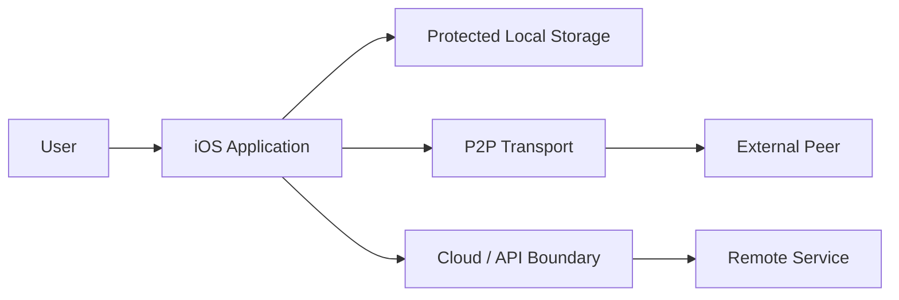

# Threat Model

## 1. Assets

Primary assets considered across the security labs:

- user identity;
- cryptographic key material;
- private messages and application data;
- authorization relationships;
- locally persisted state;
- server or synchronization tokens;
- integrity of application behavior.

## 2. Trust boundaries

Each boundary is treated as a point where input, identity and authorization must be reconsidered.

## 3. Threat categories

### Spoofing
An untrusted endpoint attempts to impersonate an authorized identity.

**Controls:** explicit identity verification, authenticated sessions and protected key material.

### Tampering
Data is modified in transit or storage.

**Controls:** authenticated encryption, signatures where appropriate, validation and integrity checks.

### Information disclosure
Sensitive information becomes visible through storage, logs, transport or metadata.

**Controls:** minimization, encryption, secure storage and redacted logging.

### Replay
Previously valid data is submitted again in an unintended context.

**Controls:** freshness, protocol state, unique nonces where required and bounded session semantics.

### Denial of service
Malformed or excessive input degrades the application.

**Controls:** bounded parsing, rate controls where applicable, cancellation and resource limits.

### Privilege abuse
A component or user receives capabilities beyond what is necessary.

**Controls:** least privilege, explicit authorization and narrow interfaces.

## 4. Security assumptions

- The operating system and platform cryptographic implementation are trusted within their documented guarantees.
- A fully compromised or unlocked endpoint can invalidate many application-level protections.
- Network peers are untrusted until authenticated and authorized.
- Remote responses are data, not instructions.
- Security properties must remain understandable during failure.

## 5. Review triggers

Update the threat model whenever a project adds:

- a new network boundary;
- authentication;
- cloud synchronization;
- new sensitive data;
- user-generated content;
- background processing;
- external integrations;
- a new cryptographic protocol.