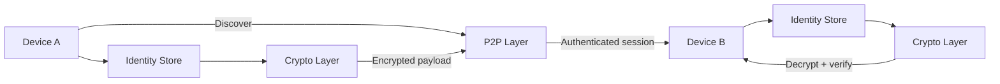

# OnyxKode Security Lab

> Defensive research notes for secure mobile communication architectures.

## Mission

Explore how a privacy-first mobile communication system can reduce trust, protect identities and remain usable under constrained connectivity.

This laboratory documents **architecture and defensive design concepts only**. It does not publish production secrets, private keys, credentials or operational infrastructure.

## Research areas

```text
identity/
├── local cryptographic identity
├── key lifecycle
├── device authorization
└── identity reset

transport/
├── peer-to-peer discovery
├── authenticated sessions
├── encrypted payloads
└── offline-first behavior

resilience/
├── timeout handling
├── reconnect strategy
├── degraded networking
└── emergency communication UX
```

## Reference architecture



## Security objectives

| Objective | Design intent |
|---|---|
| Confidentiality | Sensitive payloads should be encrypted before transport |
| Integrity | Messages should be verifiable and tamper-evident |
| Authentication | Peers should establish an identity before trusted exchange |
| Least privilege | Components should access only the data they require |
| Recoverability | Identity reset must be explicit, destructive and auditable |
| Privacy | Metadata exposure should be minimized where practical |

## Threat assumptions

The model assumes hostile networks, malformed input, accidental disclosure, stale sessions and unauthorized peers.

It does **not** assume that a compromised operating system, malicious kernel or physically captured unlocked device can always be defended against.

See the shared [Threat Model](../../docs/THREAT-MODEL.md).

## Ethical scope

Research here is intended for owned or explicitly authorized devices and environments.

**authorization > curiosity**