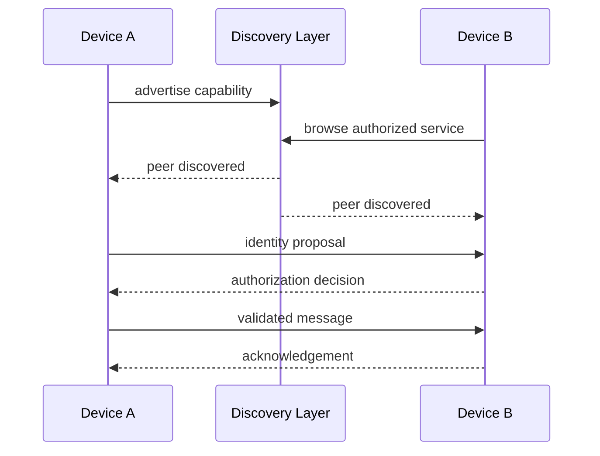

# P2P Research

> Reliability, trust and privacy experiments for peer-to-peer Apple applications.

## Research question

How can nearby devices discover each other and exchange data while keeping trust explicit and failure states understandable?

## System layers

```text
UI
↓
Session State
↓
Authorization Policy
↓
Message Validation
↓
Transport Abstraction
↓
Peer Discovery
```

## Architecture



## Engineering concerns

### Discovery
Peer discovery should not imply trust. Discovery only means a compatible endpoint is visible.

### Authorization
The application should maintain a separate authorization state instead of treating connectivity as identity.

### Validation
All inbound payloads should be treated as untrusted until decoded and validated.

### Persistence
Persist only the minimum state required to restore a safe user experience.

### Failure
Timeouts, interrupted sessions and stale peer state should be first-class conditions, not exceptional surprises.

## Test matrix

| Condition | Expected behavior |
|---|---|
| Peer disappears mid-session | Session closes cleanly |
| Duplicate discovery event | No duplicate authorization prompt |
| Unknown peer sends payload | Payload rejected |
| Malformed payload | Decode fails safely |
| App relaunches | Trust state restored only when intentionally persisted |
| Network unavailable | UI enters explicit degraded state |

## Scope

Defensive and reliability-oriented experimentation on owned or authorized devices only.