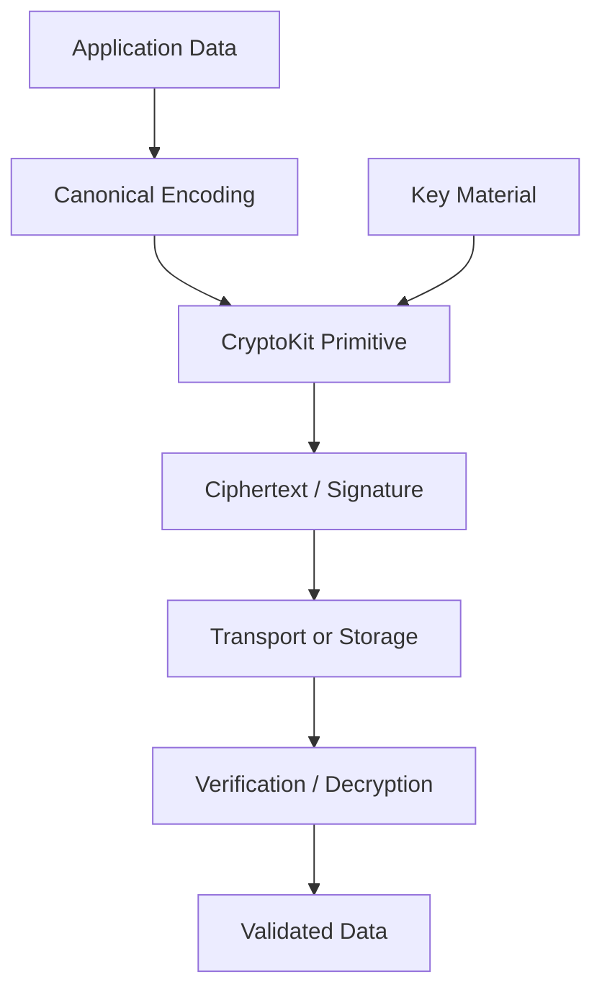

# Swift Crypto Lab

> Small, auditable experiments for learning secure application design on Apple platforms.

## Purpose

This lab focuses on understanding cryptographic building blocks in Swift without pretending that low-level cryptography should be reimplemented from scratch.

Preferred principle:

```text
use vetted primitives
compose carefully
store keys deliberately
rotate when necessary
never log secrets
```

## Topics

- CryptoKit fundamentals
- symmetric encryption concepts
- public-key identity concepts
- signatures and verification
- key derivation concepts
- secure storage boundaries
- nonce discipline
- data encoding and serialization
- key lifecycle and destruction

## Conceptual flow



## Review checklist

- [ ] Are platform-provided primitives used instead of custom crypto?
- [ ] Are keys excluded from source control?
- [ ] Are keys stored using an appropriate protected mechanism?
- [ ] Are nonces unique where required?
- [ ] Is authentication checked before accepting decrypted data?
- [ ] Are error paths non-leaky?
- [ ] Are sensitive values excluded from logs?
- [ ] Has the threat model been written down?

## Non-goals

This repository does not attempt to invent new encryption algorithms or provide offensive cryptographic tooling.

See the shared [Security Checklist](../../docs/SECURITY-CHECKLIST.md).